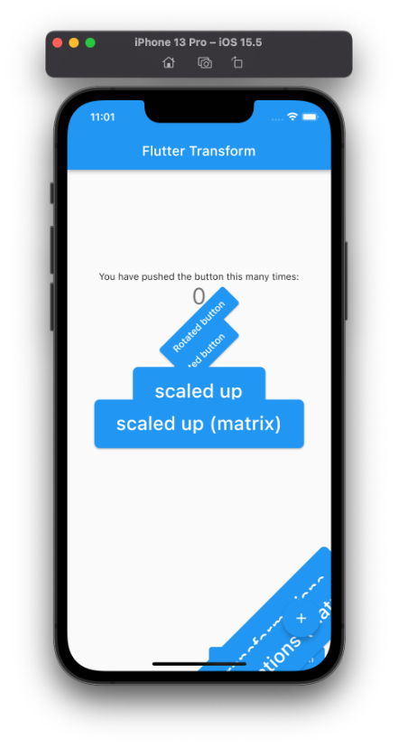
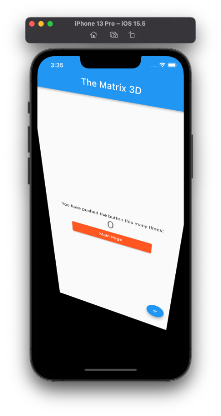
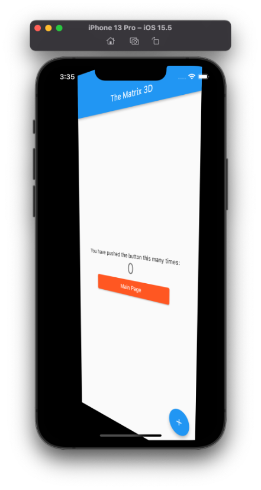
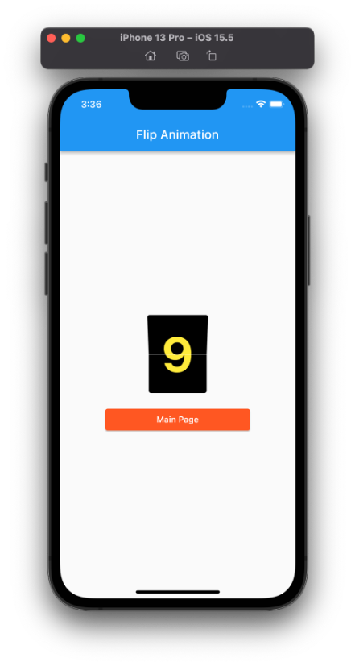

# Flutter Transform

## Langkah 1 : Buat Project Baru

Membuat project baru dengan nama **flutter_transform** pada Github.

## Langkah 2 : Import dart:math

Tambahkan library dart:math pada file `main.dart`.

```
import dart:math
```

## Langkah 3 : Tambahkan Kode Transform

Tetap di file main.dart di class _MyHomePageState pada bagian widget build, letakkan kode berikut di dalam children: setelah teks $_counter.

```
Transform.rotate(
    angle: -45 * (pi / 180.0),
    child: ElevatedButton(
      child: const Text("Rotated button"),
      onPressed: () {},
    ),
),
Transform(
  transform: Matrix4.rotationZ(-45 * (pi / 180.0)),
  alignment: Alignment.center,
  child: ElevatedButton(
    child: const Text("Rotated button"),
    onPressed: () {},
  ),
),
Transform.scale(
  scale: 2.0,
  child: ElevatedButton(
    child: const Text("scaled up"),
    onPressed: () {},
  ),
),
Transform(
  transform: Matrix4.identity()..scale(2.0, 2.0),
  alignment: Alignment.center,
  child: ElevatedButton(
    child: const Text("scaled up (matrix)"),
    onPressed: () {},
  ),
),
Transform.translate(
  offset: const Offset(100, 300),
  child: ElevatedButton(
    child: const Text("translated to bottom"),
    onPressed: () {},
  ),
),
Transform(
  transform: Matrix4.translationValues(100, 300, 0),
  child: ElevatedButton(
    child: const Text("translated to bottom (matrix)"),
    onPressed: () {},
  ),
),
Transform.translate(
  offset: const Offset(70, 200),
  child: Transform.rotate(
    angle: -45 * (pi / 180.0),
    child: Transform.scale(
      scale: 2.0,
      child: ElevatedButton(
        child: const Text("multiple transformations"),
        onPressed: () {},
      ),
    ),
  ),
),
Transform(
  alignment: Alignment.center,
  transform: Matrix4.translationValues(70, 200, 0)
    ..rotateZ(-45 * (pi / 180.0))
    ..scale(2.0, 2.0),
  child: ElevatedButton(
    child: const Text("multiple transformations (matrix)"),
    onPressed: () {},
  ),
)
```

**Run** aplikasi tersebut dengan tekan **F5**, maka hasilnya akan seperti berikut.



## Tugas Praktikum

1. Perspektif Flutter
    
    - Tugas 1
    
    
    
    - Tugas 2
    
    
    
 2. Membuat Flip Animasi 3D
 
    - Output
    
    
    
    
    
    
    
    
    
